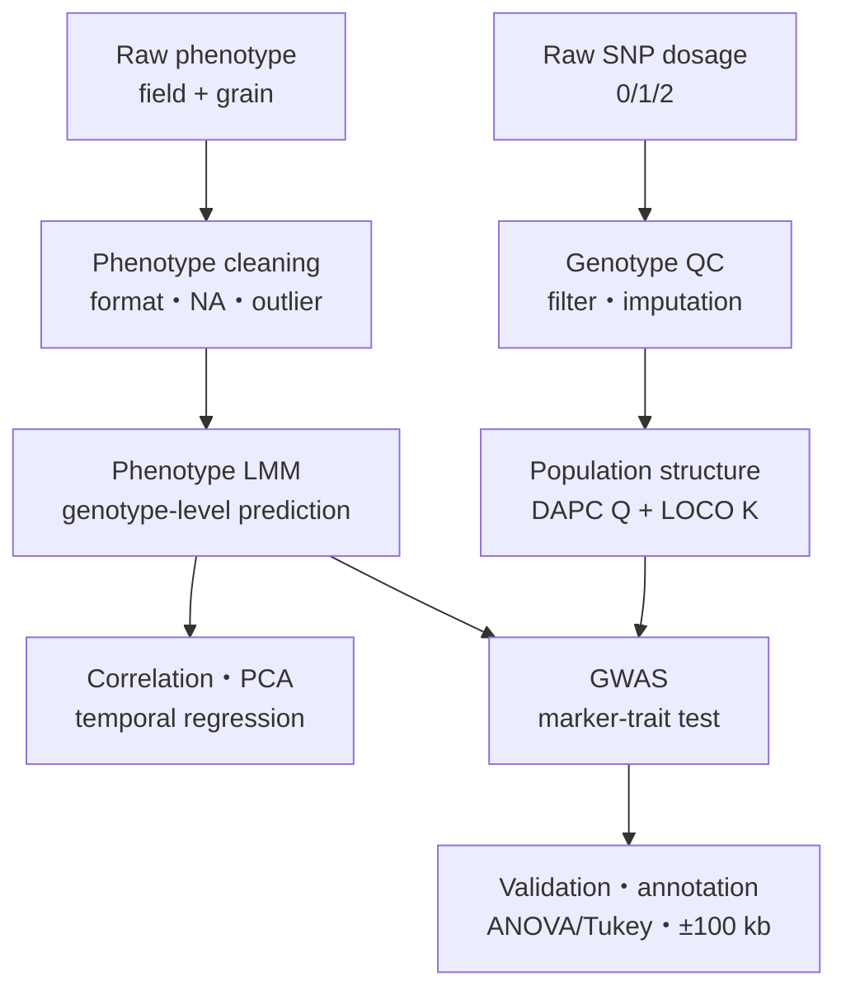
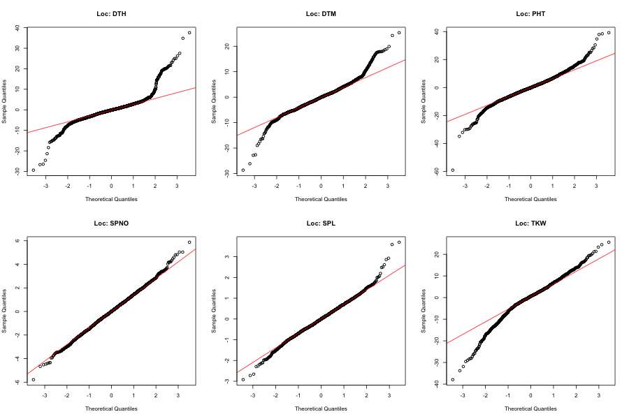
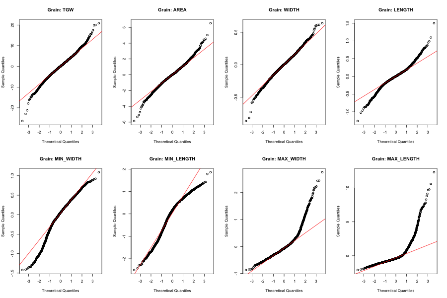
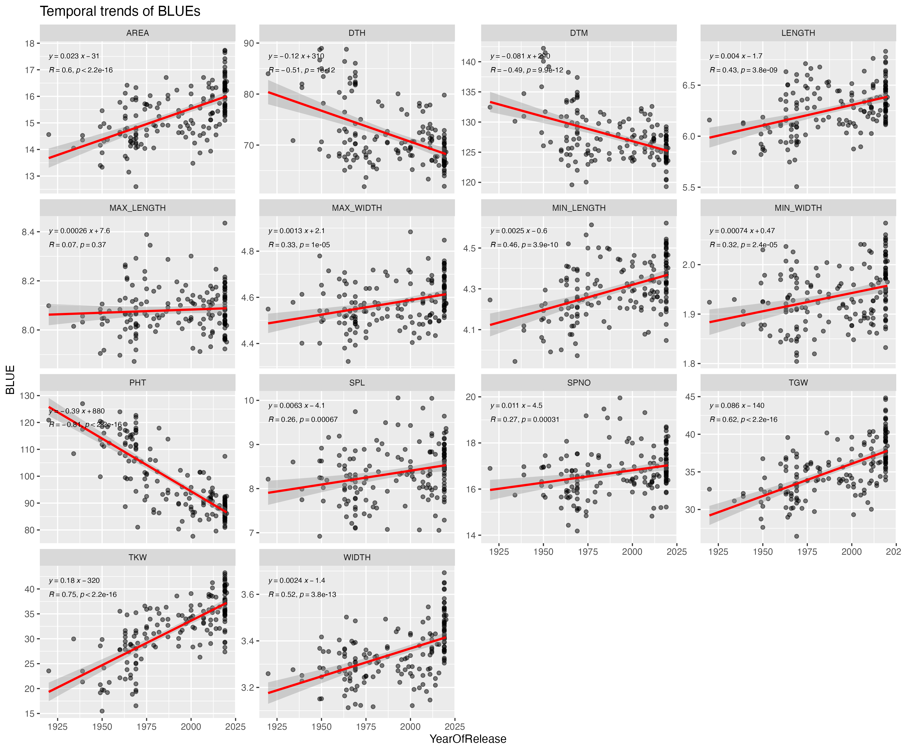
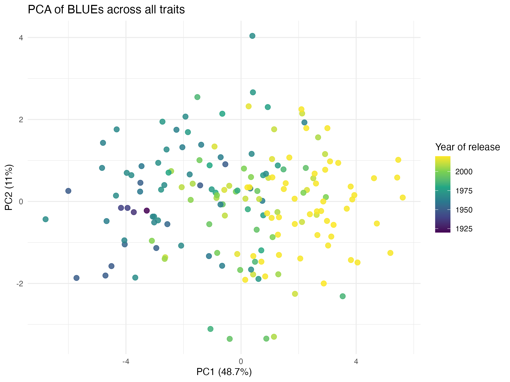

# East African wheat GWAS：自分用・再現ノート

## このノートの目的

このノートは、約185品種の東アフリカ産パンコムギについて行った、表現型の前処理、線形混合モデル（LMM）、時系列・PCA解析、遺伝子型QC、集団構造解析、GWAS、候補遺伝子解釈までを、自分でもう一度説明・再現するための記録である。

最初に結論を書くと、このパイプラインと線形モデルを理解して組めることは、かなり有用な武器になる。ただし、パッケージを実行できることより、次の4点を自分の言葉で説明できることが重要である。

1. 何を除去・補正し、その判断が結果をどう変え得るか。
2. 固定効果・ランダム効果・共変量をなぜその位置に置いたか。
3. Manhattan plotのピークが、単なる交絡や外れ値ではないとどう確認したか。
4. 同じ入力から同じ出力を再生成できるか。

これらはGWASだけでなく、RNA-seq、老化研究、臨床データ、反復測定データにも共通する技能である。

> **最重要の整理**
>
> - **Neighbour（K-nearest neighbour; KNN）と Mode は欠損遺伝子型の補完法であり、GWASモデル名ではない。**
> - このプロジェクトのGWASpolyで指定したモデルは、両補完法とも **additive model** である。
> - 精度比較ではKNNがModeよりわずかに良かったため、KNN補完側を主解析として選んだ。
> - 最終reportの主要GWAS結果は、保存されているGWASpoly結果ではなく、GAPITのFarmCPUとBLINKに基づく。

---

## 1. 解析全体の地図



大きく分けると、表現型側と遺伝子型側を別々に整え、最後に「各品種の形質値」と「各品種のSNP」をGWASで結び付けている。

| 段階 | 主な入力 | 主な処理 | 主な出力 |
|---|---|---|---|
| 表現型前処理 | field、grain Excel | 列名・型・シート・コメント行の整理 | `location_filtered.xlsx`、`grain_filtered.xlsx` |
| 表現型LMM | 反復・複数siteの測定値 | site差を考慮した品種値の推定 | 14形質 × 品種の推定値 |
| 表現型解析 | 品種推定値 + release year | 相関、PCA、年次回帰 | trend、PCA、Q–Q図 |
| 遺伝子型前処理 | 約30,083 SNP × 約185品種 | monomorphic、call rate、MAF、補完 | QC済み0/1/2行列 |
| 集団構造 | QC済みSNP | DAPC、K=4、membership | Q1–Q3 |
| GWAS | phenotype + SNP + Q + K | additive、FarmCPU、BLINK等 | p値、Manhattan、QTL |
| 解釈 | 有意SNP | genotype群比較、±100 kb annotation | 候補遺伝子 |

---

## 2. 使用したデータと形質

### 表現型

- 約185品種、4 site、各品種3反復。
- agronomic traits：DTH、DTM、PHT、SPNO、SPL、TKW。
- grain traits：TGW、AREA、WIDTH、LENGTH、MIN_WIDTH、MIN_LENGTH、MAX_WIDTH、MAX_LENGTH。
- release year：1920–2020年頃。

### 遺伝子型

- report記載の初期値は30,083 SNP、185品種。
- 0 = homozygous reference、1 = heterozygous、2 = homozygous alternate。
- コムギ自体は六倍体だが、今回のDArT/GBS行列は二倍体形式の0/1/2 dosageとして渡されたため、GWASpolyでも `ploidy = 2` を使用した。

> これは「生物学的にコムギを二倍体と仮定した」という意味ではない。**使用したマーカー行列の符号化に合わせた設定**である。

---

## 3. Step 1：表現型データのpreprocessing

対応コード：[`scripts/01_preprocessing.R`](../scripts/01_preprocessing.R)

### 3.1 raw fileを読む

- field data：`datasets/Treated_All_Location_Data_OSandMS-2.xlsx`
- grain data：`datasets/Marvin_Grain_Size_All Data_20220901.xlsx`
- Excel内の全sheetを取得し、名前に `info` を含むsheetを除外する。
- 読み込み時はいったん全列をtextとして読み、後で必要な列だけnumericへ変換する。

この方針の意味は、sheetごとにExcelが勝手に異なる型を推測して、同じ列がnumericとcharacterに分かれる事故を防ぐことである。

### 3.2 列名を標準化する

`str_trim()` で前後の空白を落とし、`tolower()` で小文字へ統一した。

例：

| raw列名 | cleaning後 |
|---|---|
| ` Genotype ` | `genotype` |
| `DTH` | `dth` |
| `Min Width` | `min width` |

列名のわずかな差は、joinの失敗や「同じ形質なのに別列になる」原因になる。前処理で最も地味だが重要な部分である。

### 3.3 必須列をそろえる

各sheetに存在しない必須列は `NA` として追加し、全sheetの列順を統一してから `bind_rows()` で縦結合した。

これにより、異なるsiteやseasonのsheetを1枚のlong tableとして扱える。

### 3.4 型を明示的に変換する

`year`、`plot`、`row`、`rep`、各traitを `as.numeric()` で変換した。

ここでは次の確認が必要である。

```r
summary(location_typed)
summary(grain_typed)
colSums(is.na(location_typed))
colSums(is.na(grain_typed))
```

変換後にNAが急増した場合、`"-"`、`"missing"`、単位付き数値などが混入していた可能性がある。

### 3.5 コメント付き行を除く

- field：`trialunitcomment` がNAの行だけ残す。
- grain：`remark` がNAの行だけ残す。

ただし現コードは空文字 `""` とNAを区別する。再実行時は次も確認する。

```r
table(is.na(location_typed$trialunitcomment),
      trimws(location_typed$trialunitcomment) == "",
      useNA = "ifany")
```

### 3.6 出力

- `data_processed/location_filtered.xlsx`
- `data_processed/grain_filtered.xlsx`

### この段階の再現チェック

- [ ] rawのsheet数と除外した `info` sheetを記録した。
- [ ] raw行数 → 結合後行数 → コメント除外後行数を記録した。
- [ ] `genotype + site + rep + plot` の重複を調べた。
- [ ] numeric変換で新しく生じたNA数を記録した。
- [ ] 単位がsite間で統一されていることを確認した。

---

## 4. Step 2：外れ値と欠損の確認

対応コード：[`scripts/05_LMM_all_traits.R`](../scripts/05_LMM_all_traits.R)

Q–Q plotでTKWの分布異常に気付き、上位値を確認したところ、TKW = 3667、1987という現実的でない値が見つかった。そこで現コードでは `TKW < 100` またはNAの行だけを残し、TKWモデルを再fitした。

```r
location_filtered <- location_filtered %>%
  filter(tkw < 100 | is.na(tkw))
```

### この判断の意味

外れ値を削除したのは「統計的に大きいから」だけではなく、コムギのTKWとして単位・入力ミスが疑われるほど非現実的だったためである。

再現時には、単純に同じ閾値を使うだけでなく、次を記録する。

- 削除した行のgenotype、site、rep、元の値。
- 元データの単位。
- 小数点や桁の入力ミスを修正できないか。
- 削除前後でモデル結果がどれだけ変わったか。

> 外れ値処理は結果を変え得る分析判断である。コードに閾値だけ残すのではなく、理由と対象行をtableとして保存する。

---

## 5. Step 3：表現型のLinear Mixed Model

### 5.1 なぜ単純平均ではなくLMMを使ったか

同じ品種が複数site・repで測定されている。観測値には、品種本来の違いだけでなく、site環境と測定誤差が混ざる。

単純化した架空例：

| Genotype | Site | Rep 1 | Rep 2 | 単純平均 |
|---|---|---:|---:|---:|
| A | dry site | 70 | 72 | 71 |
| A | wet site | 84 | 82 | 83 |
| B | dry site | 74 | 73 | 73.5 |
| B | wet site | 88 | 90 | 89 |

site差を無視すると、「wet siteに多く配置された品種」が実力以上に高く見える可能性がある。LMMは、全体平均、品種差、site差、残差に分解する。

### 5.2 実際のRコードがfitしたモデル

```r
trait ~ 1 + (1 | genotype) + (1 | site)
```

数式では、

\[
y_{gsi} = \mu + u_g + v_s + \varepsilon_{gsi}
\]

- \(y_{gsi}\)：genotype \(g\)、site \(s\)、反復 \(i\) の観測値。
- \(\mu\)：全体平均（fixed intercept）。
- \(u_g\)：genotypeごとの平均からのずれ（random effect）。
- \(v_s\)：siteごとのずれ（random effect）。
- \(\varepsilon_{gsi}\)：モデルで説明されない残差。

分布仮定は、おおまかに次である。

\[
u_g \sim N(0,\sigma_g^2),\quad
v_s \sim N(0,\sigma_s^2),\quad
\varepsilon_{gsi} \sim N(0,\sigma_e^2)
\]

14形質それぞれに同じ構造のモデルを `lmer(..., REML = TRUE)` でfitした。

### 5.3 このプロジェクトの「BLUE」は厳密には何か

コードでは次を計算し、列名をBLUEとしている。

\[
\widehat{y}_g = \widehat{\mu} + \widehat{u}_g
\]

- \(\widehat{\mu}\)：fixed interceptの推定値。
- \(\widehat{u}_g\)：genotype random effectのBLUP。
- 合計は品種ごとの条件付き予測値、またはgenotypic valueに近い。

**厳密な用語：**

| genotypeの扱い | R式の例 | genotypeについて得るもの |
|---|---|---|
| fixed effect | `trait ~ genotype + (1|site)` | BLUE（Best Linear Unbiased Estimate） |
| random effect | `trait ~ 1 + (1|genotype) + (1|site)` | BLUP（Best Linear Unbiased Prediction） |

このプロジェクトの実コードは後者である。したがって、既存ファイル名を説明するときは「BLUE table」と呼んでもよいが、統計的説明では **intercept + genotype BLUP** と言うのが安全である。

### 5.4 reportとの不一致

reportは `Trait = Genotype + (1|Site)` と書き、genotypeをfixed effectとして説明している。一方、実コードはgenotypeもsiteもrandom effectである。

さらにreportには「3反復の平均を先に計算した」とあるが、保存コードでは反復平均を作らず、測定行をそのままLMMへ入れている。再解析時は、どちらを正式仕様にするか決める必要がある。

### 5.5 fixedかrandomかをどう選ぶか

- 今回の約185品種そのものを1品種ずつ比較し、それぞれの平均を報告したい：genotypeをfixedとする選択が自然。
- 今回の品種を、より大きな育種集団からの標本と考え、分散成分や縮小推定を使いたい：genotypeをrandomとする選択が自然。
- 4 site固有の差を直接比較したい：siteをfixedにする考え方もある。
- 多数あり得る栽培環境の標本としてsite間分散を推定したい：siteをrandomにする。

正解は目的による。重要なのは、解析後に都合よく選ばず、**研究質問と推論対象を先に明文化すること**である。

### 5.6 REMLの意味

`REML = TRUE` は分散成分の推定に適している。同じfixed-effect構造の最終モデルでBLUPを得る目的には妥当である。fixed effectが異なるモデル同士を尤度で比較する場合は、通常いったん `REML = FALSE` で比較する。

---

## 6. Step 4：LMMのdiagnostics

### residual Q–Q plot





Q–Q plotは、モデル残差の分位点と正規分布の理論分位点を比較する。

- 点が中央から端まで直線に近い：正規性仮定と大きく矛盾しない。
- 両端だけ曲がる：heavy tail、外れ値、分布の歪みが疑われる。
- S字型：分散や分布形の不一致が疑われる。

実際の図ではSPNOとSPLは比較的直線に近いが、DTH、DTM、PHT、TKW、および一部grain size形質の端で大きなずれがある。したがって「全形質で残差は正規的だった」と単純には結論しない。

次回はQ–Q plotだけでなく、最低限次も確認する。

```r
plot(fitted(model), resid(model))      # 分散不均一・非線形
qqnorm(resid(model)); qqline(resid(model))
isSingular(model)                      # random-effect分散がほぼ0か
VarCorr(model)                         # genotype/site/residual分散
```

必要に応じて、変換、分散構造の変更、外れ値の感度分析、site × genotype interactionを検討する。

---

## 7. Step 5：品種ごとの推定値を統合

location 6形質とgrain 8形質の推定tableを `Genotype` でfull joinし、release-year tableも結合した。

```r
blue_all <- full_join(blue_loc, blue_grain, by = "Genotype")
blue_all <- full_join(blue_all, release, by = "Genotype")
```

保存先：

- `data_processed/blue_all_with_year.xlsx`

コード内コメントでは、約3,375測定行から約197品種行へ集約されたとしている。これは「データを捨てた」のではなく、反復・siteごとの観測から品種レベルの予測値へ要約したためである。ただし再実行時には、raw品種数、LMM出力品種数、release year結合後の品種数を実測して記録する。

---

## 8. Step 6：correlation、temporal regression、PCA

対応コード：[`scripts/06_BLUE_visualisation.R`](../scripts/06_BLUE_visualisation.R)

### 8.1 correlation

14形質の品種推定値について、欠損ペアを除いてPearson correlationを計算した。

```r
cor_matrix <- cor(blue_traits, use = "pairwise.complete.obs")
```

reportでは、grain size・weight（TKW、TGW、AREA、WIDTH、LENGTH）同士が正に相関し、PHT・DTH・DTMが別の正相関clusterを形成し、2群間は概して負の関係だった。

> **ファイル上の注意：** 現在の `figures/correlation_heatmap.png` は、ファイル名と異なりtemporal-trend図になっている。相関heatmapを引用するときは、コードから再生成して内容を目視確認する。

### 8.2 release yearとの線形回帰

各形質について、次の単回帰を行った。

\[
\widehat{Trait}_g = \beta_0 + \beta_1 Year_g + \varepsilon_g
\]

- \(\beta_1 > 0\)：新しい品種ほど値が増加。
- \(\beta_1 < 0\)：新しい品種ほど値が減少。
- p値：\(\beta_1 = 0\) の帰無仮説から観測結果がどの程度ずれるか。
- \(R\)：年と形質の線形な関連方向・強さ。



図から読み取れる主要傾向：

| Trait | 年あたりの傾き（図中式） | R | 解釈 |
|---|---:|---:|---|
| PHT | -0.39 | -0.81 | 新しい品種ほど明確に短稈化 |
| DTH | -0.12 | -0.51 | headingが早期化 |
| DTM | -0.081 | -0.49 | maturityが早期化 |
| TKW | +0.18 | +0.75 | kernel weightが増加 |
| TGW | +0.086 | +0.62 | grain weightが増加 |
| AREA | +0.023 | +0.60 | grain areaが増加 |
| MAX_LENGTH | +0.00026 | +0.07 | p = 0.37で明確な線形傾向なし |

この回帰は「release yearと形質の関連」を示す。release year以外の育種系譜、国、site構成などを完全に分離した因果効果ではない。

### 8.3 PCA

欠損のある品種を `na.omit()` で除き、14形質を標準化してPCAを行った。

```r
pca_res <- prcomp(trait_data, scale. = TRUE)
```



- PC1：48.7%
- PC2：11.0%
- 合計：59.7%

色はrelease yearで、古い品種から新しい品種への勾配が主にPC1方向に見える。ただし、どの形質がPC1を正・負方向へ押しているかを断定するには `pca_res$rotation`（loadings）を確認する必要がある。score plotだけで形質寄与を決めない。

---

## 9. Step 7：遺伝子型preprocessing

この段階はreportには記載されているが、完全なQC・補完比較スクリプトはリポジトリにない。

report上の処理：

1. GBS SNPを `dartR` の `genlight` objectへ変換。
2. monomorphic lociを除去。
3. call rate ≥ 0.70を保持。
4. MAF < 0.10を除去。
5. technical replicateのmean reproducibilityを計算。
6. SNP行列とmetadataをTaxaで対応付け。

### 各filterの意味

| Filter | 除きたいもの | なぜ必要か |
|---|---|---|
| monomorphic | 全品種で同じalleleのSNP | trait差を説明できない |
| call rate | 欠損が多いSNP | 補完依存・偽陽性が増える |
| MAF | rare alleleのみのSNP | 少数群だけで効果を推定し不安定 |
| reproducibility | 技術反復で一致しないSNP | genotyping errorの可能性 |

再現時には「30,083 SNPから各filter後に何SNP残ったか」を必ず表にする。現在のreportには最終SNP数とreproducibility閾値が明確に残っていない。

---

## 10. Step 8：missing genotypeのimputation

既知genotypeの一部を人工的に隠し、補完値が元の値と一致する割合を比較した。

比較した方法は、KNN（Neighbour）、MissForest、Mode、Frequency、Hardy–Weinberg、Random Forest。

- KNN：約0.66で最高。
- Mode：約0.64。
- したがってKNN補完を主解析に採用し、Modeは比較解析として残した。

### KNNとModeの直感

架空例：

| Sample | SNP1 | SNP2 | SNP3 |
|---|---:|---:|---:|
| A | 0 | 1 | NA |
| B（Aに近い） | 0 | 1 | 2 |
| C | 2 | 0 | 0 |

- Mode：SNP3全体で最頻のgenotypeを入れる。
- KNN：他SNPのpatternがAに近いsampleを探し、その近傍からSNP3を予測する。

KNNはsample間の遺伝的類似性を利用するため、今回わずかに高精度だった。ただし、補完法が後続GWASのp値へ影響するため、採用法と比較結果を保存する。

---

## 11. Step 9：DAPCによるpopulation structure

対応コード：

- [KNN側GWASpoly script](../GWASpoly/neighbour/GWASpoly_Neighbor_Imputed.R)
- [Mode側GWASpoly script](../GWASpoly/mode/GWASpoly_Mode_Imputed.R)

### なぜ集団構造を補正するか

traitと関係のないSNPでも、遺伝的集団Aに多く、同時に集団Aでtraitが高ければ、見かけ上関連してしまう。

\[
Population\ ancestry \rightarrow SNP
\]

\[
Population\ ancestry \rightarrow Trait
\]

この共通原因を補正しないと、SNP → Traitのように誤認する。

### 実施内容

1. QC・補完後の0/1/2行列から `genlight` を作成。
2. `find.clusters(max.n.clust = 10, n.pca = 100)` のBICを確認。
3. K = 4を採用。
4. `dapc(..., n.pca = 20, n.da = 3)` を実行。
5. 各sampleのcluster membership probabilityを取得。
6. Q1、Q2、Q3をphenotype tableへ追加。Q4は4確率の和が1で完全共線になるため省略。

結果PDF：

- [KNN BIC](../GWASpoly/neighbour/BIC_plot_member1.pdf)
- [KNN DAPC scatter](../GWASpoly/neighbour/DAPC_scatter_member1.pdf)
- [KNN membership composition](../GWASpoly/neighbour/DAPC_compoplot_member1.pdf)

---

## 12. Step 10：GWASpoly

### 12.1 phenotypeとgenotypeを同じ順序にする

GWASで最も危険な事故の1つは、SNP行列のsample順とphenotypeのsample順がずれることである。

コードではTaxaの共通集合を取り、184 sampleへ合わせた。元の185品種のうち1品種が一致しなかった。

再現時は数だけでなく、次を確認する。

```r
stopifnot(identical(pheno_GWAS$Taxa, colnames(geno_GWAS)[-c(1:3)]))
```

### 12.2 GWASpoly用の形

- genotype：1行1marker、先頭3列がMarker、Chrom、Position、その後がsample。
- phenotype：1行1sample、Taxa + 14 traits + Q1–Q3。

### 12.3 kinship

`set.K(data, LOCO = TRUE)` でkinship matrixを作成した。

LOCO（Leave One Chromosome Out）は、検定中のchromosomeをkinship計算から除く。検定対象SNPのsignalまでkinshipに吸収され、真の関連が弱く見えるproximal contaminationを減らすためである。

### 12.4 association model

概念的な式は、

\[
y = X\alpha + SNP_j\beta_j + Zu + \varepsilon
\]

- \(X\alpha\)：interceptとpopulation membershipなどの共変量。
- \(SNP_j\beta_j\)：今検定しているSNPのadditive effect。
- \(u \sim N(0,K\sigma_g^2)\)：kinship \(K\) で表す背景遺伝効果。
- \(\varepsilon\)：残差。

14形質すべてを `models = "additive"` でscanした。

### 12.5 multiple testing

多数のSNPを同時に検定するため、未補正p < 0.05では多数の偶然ピークが出る。GWASpolyではBonferroni level 0.05を使用し、保存結果の \(-\log_{10}(p)\) thresholdは5.27だった。

例えば、

\[
-\log_{10}(p)=5.27 \Rightarrow p \approx 5.37\times10^{-6}
\]

### 12.6 KNN補完側のGWASpoly結果

| Trait | Marker | Chr | Position | Score | Effect |
|---|---|---:|---:|---:|---:|
| DTH | 5578553-17-A/G | 不明 | 0 | 5.78 | -3.38 |
| DTH | 2260918-59-T/G | 5A | 584,618,681 | 5.41 | -2.26 |
| DTH | 2262549-28-T/G | 5A | 586,669,359 | 5.92 | -2.46 |
| PHT | 992433-48-G/A | 2B | 25,458,537 | 5.73 | +4.31 |

対応ファイル：

- [KNN QTL table](../GWASpoly/neighbour/QTL_results_member1.csv)
- [KNN Manhattan](../GWASpoly/neighbour/manhattan_member1.pdf)
- [KNN GWAS Q–Q](../GWASpoly/neighbour/qq_member1.pdf)

染色体が空欄、Position = 0の `5578553-17-A/G` はmap join失敗または未配置markerの可能性がある。座標を解決するまでcandidate-gene annotationへ進めない。

### 12.7 Mode補完側のGWASpoly結果

| Trait | Marker | Chr | Position | Score | Effect |
|---|---|---:|---:|---:|---:|
| DTH | 2260918-59-T/G | 5A | 584,618,681 | 5.79 | -2.31 |
| DTH | 1135154-9-G/A | 5A | 584,712,084 | 6.28 | +2.36 |
| DTH | 2262549-28-T/G | 5A | 586,669,359 | 5.46 | -2.31 |

対応ファイル：

- [Mode QTL table](../GWASpoly/mode/QTL_results_member2.csv)
- [Mode Manhattan](../GWASpoly/mode/manhattan_member2.pdf)
- [Mode GWAS Q–Q](../GWASpoly/mode/qq_member2.pdf)

KNNとModeで共通したのは、5A上の `2260918-59-T/G` と `2262549-28-T/G` である。補完法を変えても残った点は頑健性の材料になるが、独立datasetでの再現ではない。

### 12.8 R²の注意

`fit.QTL()` の保存結果では、KNN側のPHT markerはR² ≈ 0.118、DTHの未配置markerはR² ≈ 0.127だった。一方、5A markersやMode側markersのjoint fitではR²が小さく、p値も有意でないものがある。

これはscan時の単一marker thresholdと、選択後のjoint modelの評価が同じではないため起こり得る。したがって「Manhattan thresholdを超えた = 大きく安定した効果」とは言わず、effect、R²、allele count、LD、再現性をまとめて判断する。

---

## 13. Step 11：GAPIT（FarmCPU・BLINK）と最終report

最終reportの主要Manhattan plotと有意SNP tableは、GAPITのFarmCPUとBLINKで共通したsignalを中心にしている。

| SNP | Chr | Position | Trait | FarmCPU -log10(p) | BLINK -log10(p) |
|---:|---:|---:|---|---:|---:|
| 1057749 | 1B | 685,117,897 | DTH | 12.00 | 10.91 |
| 1244465 | 2B | 94,925,484 | DTH | 6.67 | 6.30 |
| 992116 | 2B | 216,469,247 | DTH | 7.41 | 5.94 |
| 984177 | 6A | 38,379,225 | DTH | 9.24 | 7.93 |
| 1140879 | 6D | 22,769,897 | DTM | 8.93 | 8.54 |
| 1107370 | 7A | 712,831,281 | PHT | 8.50 | 10.75 |

これらは保存GWASpolyのmarker・座標と一致しない。したがって、

- GWASpolyは実行された。
- しかし最終reportの主要lociへ直接統合された証拠は保存ファイルから確認できない。
- 「3 GWAS methodsで一致したSNP」という表現は、現在の保存物だけでは再確認できない。

さらに、reportのPHT markerは本文・有意SNP tableで7A:712,831,281だが、candidate-gene tableでは7A:628,984,333となっている。annotationを再利用する前に、正しいmarker座標を確認する。

> FarmCPU・BLINKのコードとstandalone outputは現在のリポジトリにないため、この部分は現状では完全再現できない。

---

## 14. Step 12：有意SNPのphenotypic checkとannotation

### 14.1 genotype群の比較

有意SNPについて、reference homozygote、heterozygote、alternate homozygoteのtrait分布を比較し、one-way ANOVAとTukey HSDを行った。

目的は、GWASのp値だけでなく、alleleが変わると形質分布がどちらへどれだけ動くかを見ることである。

ただし、同じdatasetで「SNPを発見」し、同じdatasetでANOVAを行うため、これは独立validationではない。効果の可視化・整合性確認と考える。

### 14.2 candidate gene annotation

有意SNPの上下100 kbをEnsembl Plants上で検索し、近傍遺伝子を調べた。直接annotationが乏しい場合は関連speciesのorthologも調べた。

\[
Window = [SNP\ position - 100,000,\; SNP\ position + 100,000]
\]

candidate geneは「そのwindow内にある生物学的にもっともらしい遺伝子」であり、原因遺伝子の証明ではない。LD範囲、gene expression、functional assay、独立集団での再現が追加で必要になる。

---

## 15. 2種類のQ–Q plotを混同しない

| Q–Q plot | 比べているもの | 主な目的 |
|---|---|---|
| LMM residual Q–Q | 残差 vs 正規分布 | 線形混合モデルの分布仮定を診断 |
| GWAS Q–Q | 観測p値 vs 帰無仮説下のp値 | population structure、kinship、test inflationを診断 |

GWAS Q–Qで全体が対角線より早く上へずれる場合、真のpolygenic signalの可能性もあるが、集団構造未補正やrelatednessによるinflationも疑う。末端だけが上がるのが、少数の真のassociationにより近い理想像である。

---

## 16. 現在のrepositoryでの再現可能性

| 部分 | 現状 | 主な不足・注意 |
|---|---|---|
| 表現型raw → filtered | ほぼ可能 | 行数logと型変換warningを残す必要 |
| LMM → 品種推定値 | 部分的に可能 | objectをsessionに依存、BLUE/BLUP仕様が不一致 |
| temporal/PCA | 部分的に可能 | `results` objectが未定義、figure名の取り違え |
| genotype QC | 不可 | 完全なQC scriptと元genotypeがない |
| imputation比較 | 不可 | 比較script・mask設計・全出力がない |
| GWASpoly | 入力があれば可能 | hard-coded HPC path、外部GD/GM/phenoが必要 |
| GAPIT FarmCPU/BLINK | 不可 | codeとstandalone outputがない |
| annotation | 手作業記録のみ | PHT座標に不一致あり |

### repository内で確認できる重要ファイル

- [Final report](../reports/project_report_2025-26.docx)
- [Phenotype preprocessing](../scripts/01_preprocessing.R)
- [All-trait LMM](../scripts/05_LMM_all_traits.R)
- [Phenotype visualisation](../scripts/06_BLUE_visualisation.R)
- [KNN GWASpoly](../GWASpoly/neighbour/GWASpoly_Neighbor_Imputed.R)
- [Mode GWASpoly](../GWASpoly/mode/GWASpoly_Mode_Imputed.R)

`scripts/02_merge_field_grain.R` は空fileである。`scripts/03_LLM_estimates.R` と `scripts/04_merge_BLUE_tables.R` は初期の一部形質版で、再現の中心は `05_LMM_all_traits.R` である。

---

## 17. もう一度実行するときの順番

### A. phenotype側

1. repository rootをworking directoryにする。
2. R/package versionを記録する。将来は `renv` を使う。
3. `01_preprocessing.R` を実行。
4. 出力行数、NA、重複、除外行をQC tableへ保存。
5. `05_LMM_all_traits.R` を上から実行。
6. TKW外れ値の対象行と除外理由を保存。
7. 各モデルの `VarCorr`、`isSingular`、residual-vs-fitted、Q–Qを保存。
8. genotypeをfixedにしたBLUEと、randomにしたBLUPを比較し、正式仕様を決める。
9. release yearを結合し、unmatched genotypeを記録。
10. `06_BLUE_visualisation.R` の未定義 `results` 部分を整理してから、correlation、temporal regression、PCAを再生成。
11. PCA loading tableも保存。

### B. genotype側

1. raw GD、GM、Taxa metadataをそろえる。
2. marker ID・Chromosome・Positionの欠損と重複を調べる。
3. monomorphic → call rate → MAF → reproducibilityの順でfilterし、各段階のSNP数を保存。
4. sample call rate、heterozygosity、重複sampleも確認。
5. 既知値maskの乱数seedとmask割合を固定し、各imputation法を同じmaskで比較。
6. KNNを主解析、Modeをsensitivity analysisとして保存。
7. phenotypeとgenotypeのTaxa・順序を `stopifnot()` で検証。

### C. GWAS側

1. DAPCのBICからKを決め、選択根拠を保存。
2. DAPC Q1–Q3とLOCO kinshipを作る。
3. additive GWASpolyを14形質に実行。
4. ManhattanとGWAS Q–Qを全形質分保存。
5. Bonferroni/FDRの閾値、marker数、sample数をresult tableへ付ける。
6. allele count、MAF、effect、R²、p値を有意SNPごとに確認。
7. KNNとModeの共通signalを比較。
8. GAPIT FarmCPU・BLINKを同じinputで再実行し、method間の共通・固有signalをtable化。
9. SNP map座標を再確認後、±100 kb annotation。
10. 独立dataset、またはcross-validation可能な設計があれば再現性を検証。

---

## 18. この解析を「自分の武器」にする次の練習

### 1. LMMを自分で設計し直す

同じtraitに対して次を比較する。

```r
# genotype fixed：各品種のBLUEを得る考え方
m_fixed <- lmer(trait ~ genotype + (1 | site), data = dat)

# genotype random：BLUPと分散成分を得る考え方
m_random <- lmer(trait ~ 1 + (1 | genotype) + (1 | site), data = dat)
```

両者の品種ranking、推定値の縮小、標準誤差がどう変わるかを見る。ここまで説明できれば、単に `lmer()` を使える段階から、研究質問に合わせてモデルを設計できる段階へ進める。

### 2. preprocessingを完全にself-containedにする

- script冒頭でinputを読む。
- analysis中に `install.packages()` しない。
- hard-coded `setwd()` をなくす。
- seed、package version、filter後件数を保存する。
- 重要な対応関係は `stopifnot()` で止める。

### 3. GWASを「ピーク探し」ではなくmodel checkingとして行う

- population structureを入れた/入れない場合のQ–Qを比較。
- kinshipを入れた/入れない場合のinflationを比較。
- imputation法を変えたときのsignalを比較。
- effect、MAF、allele count、R²、annotationを1つのtableへまとめる。

この3つができれば、GWAS経験は履歴書上のツール名ではなく、「複雑なデータをQCし、交絡をモデル化し、多重検定を扱い、結果を再現可能に解釈できる」実務的な能力になる。

---

## 19. 最後に：このプロジェクトを一文で説明する

> 複数site・反復で測定された東アフリカ産コムギの14形質を線形混合モデルで品種レベルに補正・要約し、SNP QC、欠損補完、DAPCによる集団構造、kinshipを考慮したGWASを組み合わせ、過去100年間の育種に伴う形質変化とDTH・DTM・PHT関連lociを探索した。

ただし、完全再現のためには、遺伝子型QC・補完比較・GAPITのscriptとinputを回収し、BLUE/BLUPのモデル仕様、PHT annotation座標、figure名を再確認する必要がある。
